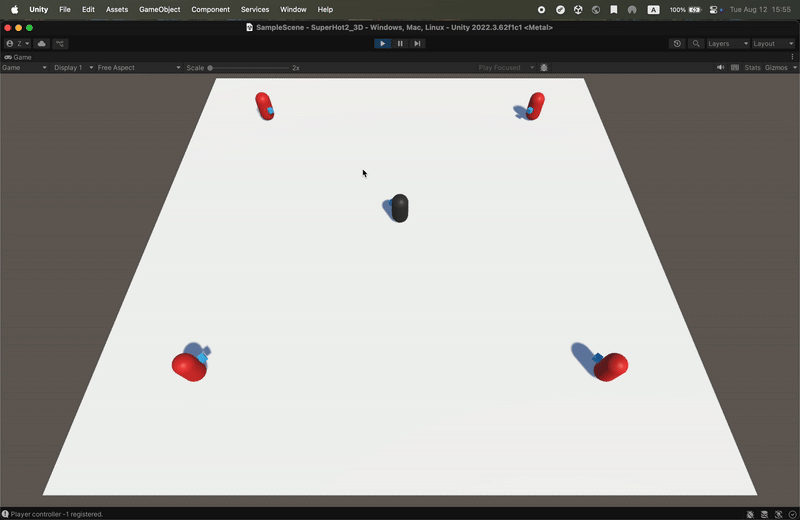
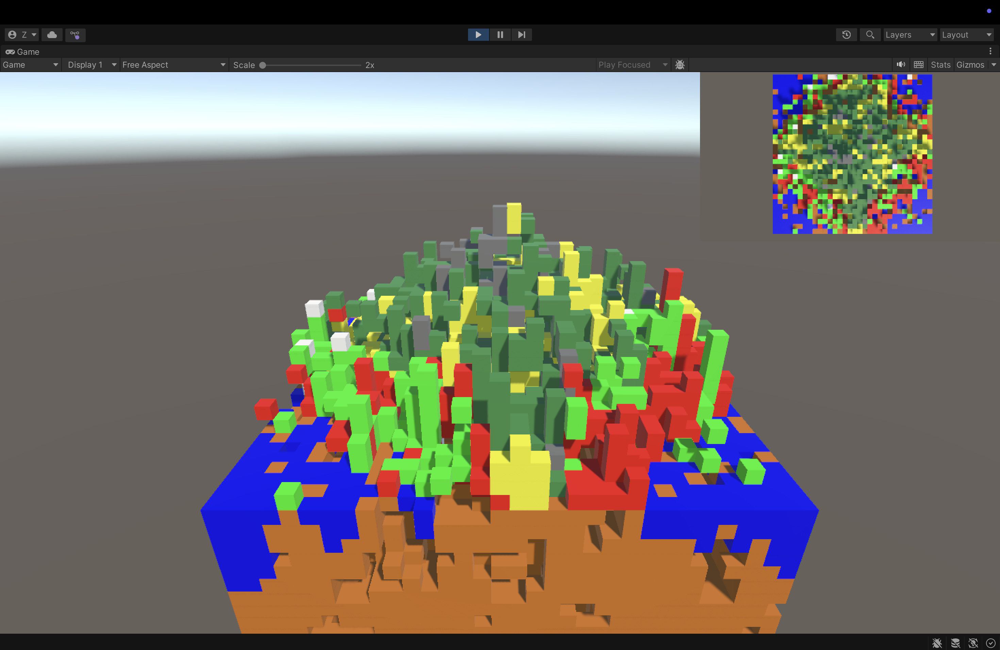

# 🎮 Game Mechanics Showcase

> A collection of Unity-based gameplay prototypes exploring unique core mechanics in modern game design.

---

## 🕒 SuperHot Recreation

A Unity recreation of **SuperHot’s** core experience — where **time only moves when you move**.  
Rebuilt from scratch to replicate its **time manipulation** and **combat replay** mechanics, delivering the signature “time as a weapon” tactical shooter experience.

### 🧩 Core Features
- Time-based motion control  
- Bullet-time combat system  
- Replay system capturing player motion  

### 🛠️ Upcoming Plans
- [ ] 2–4 player online mode with synchronized time flow  
- [ ] Cooperative and competitive tactical missions  

---

## 💣 Bomber

A physics-based platformer where you **are the bomb** — using explosive recoil to **jump**, **double-jump**, and **propel** yourself through the level.

### 🧩 Core Features
- Explosion-driven movement system  
- Diagonal jump and aerial control mechanics  

### 🛠️ Upcoming Plans
- [ ] Destructible environment and obstacle interaction  
- [ ] Advanced recoil chaining for combo movement  

---

## 🌍 Minecraft Recreation

A reimagining of **Minecraft’s** procedural world generation powered by **Perlin Noise**.  
Faithfully reproduces its **chunk-based terrain system** while optimizing generation logic for performance and scalability.

### 🧩 Core Features
- Procedural terrain via 2D/3D Perlin noise  
- Real-time mesh generation  
- Chunk-based streaming and culling  

### 🛠️ Upcoming Plans
- [ ] Parallelized terrain generation  
- [ ] Improved chunk loading pipeline  
- [ ] Implementation of block types and materials  

---

## 🌌 ParticleLife

A **particle simulation sandbox** where particles interact according to customizable attraction rules.  
Design your own **attraction matrix**, spawn colorful particles, and watch emergent behaviors unfold — from orbiting swarms to chaotic ecosystems.

<!--  -->

### 🧩 Core Features
- Interactive particle system driven by a configurable attraction matrix  
- Real-time parameter tuning and visualization  
- Boundary selection and spawn control for creative setups  
- Emergent pattern generation through simple local rules  

### 🕹️ Basic Procedure
1. **Select area** → Draw a boundary for spawning particles  
2. **Spawn** → Create particles in the selected region  
3. **Pause / Space** → Switch between Edit and Simulation mode  
4. Adjust parameters to generate diverse visual patterns  

### 🎛️ Controls

**UI Controls**
- `M` — Toggle menu  
- `Esc` — Close color picker  

**Simulation Controls**
- `Space` — Pause / Resume simulation  
- `R` — Clear all particles  
- `B` — Enter or exit boundary selection mode  
- `<` / `>` — Decrease / Increase force magnitude  

### 🛠️ Upcoming Plans
- [ ] Store settings in local storage  
- [ ] Improved UI and extended customization options  
- [ ] 3D particle support  

---

## 🧠 Tech Stack
- **Engine:** Unity (URP)  
- **Language:** C#  
- **Frameworks:** DOTS  
- **Focus:** Gameplay prototyping, procedural systems, player feedback  

---

## 📬 Contact
**Author:** [Zong]  
**Portfolio:** [zong4.github.io](https://zong4.github.io)  
**Email:** [zzoonng@163.com](mailto:zzoonng@163.com)

> _“Play is the highest form of research.” – Albert Einstein_
